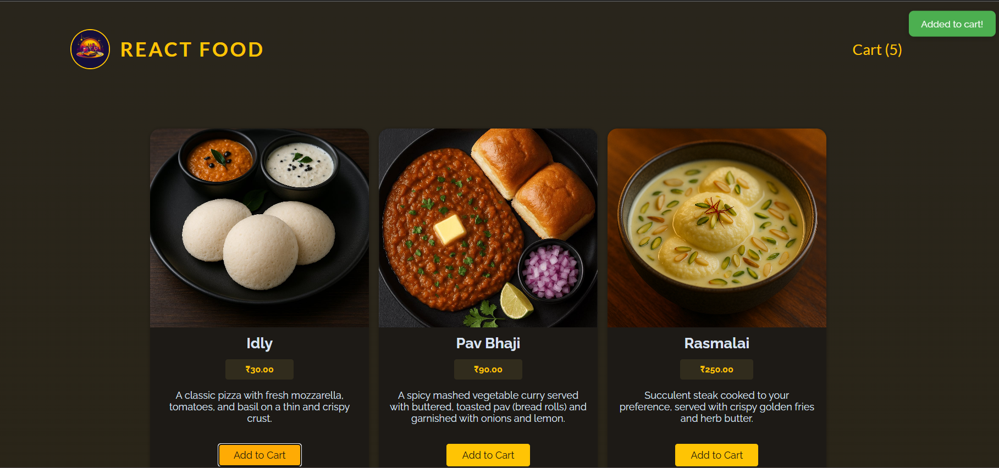
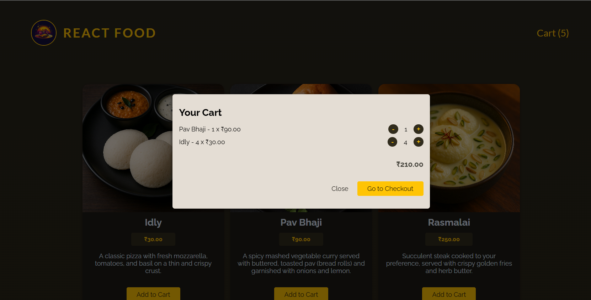

# React-Food
A fully functional food ordering web app built with **React** on the frontend and **Node.js/Express** on the backend. Users can browse a menu, add items to a cart, fill out a checkout form, and place an order — with live data fetching and a deployed API.

---

## 🔗 Live Link

 live version of the **React Food** App here:  https://reactfood-a9609.web.app/
  
---

## 🧰 Tech Stack

### Frontend:
- React (with Hooks & Context)
- CSS Modules
- Custom HTTP hooks
- Firebase Hosting

### Backend:
- Node.js
- Express.js
- Render Hosting (with GitHub integration)

---

## 🎯 Features

- Browse meals with descriptions and images
- Add meals to cart with quantity tracking
- Visual feedback with "Added to Cart" popup
- Secure checkout form (name, email, address)
- Order submission via HTTP POST request
- Backend API built with Express and hosted on Render

---

## ⚙️ Backend API Endpoints

| Method | Route           | Description                    |
|--------|------------------|--------------------------------|
| GET    | `/meals`         | Returns all available meals    |
| POST   | `/orders`        | Accepts customer order data    |

Image URLs use backend path:

